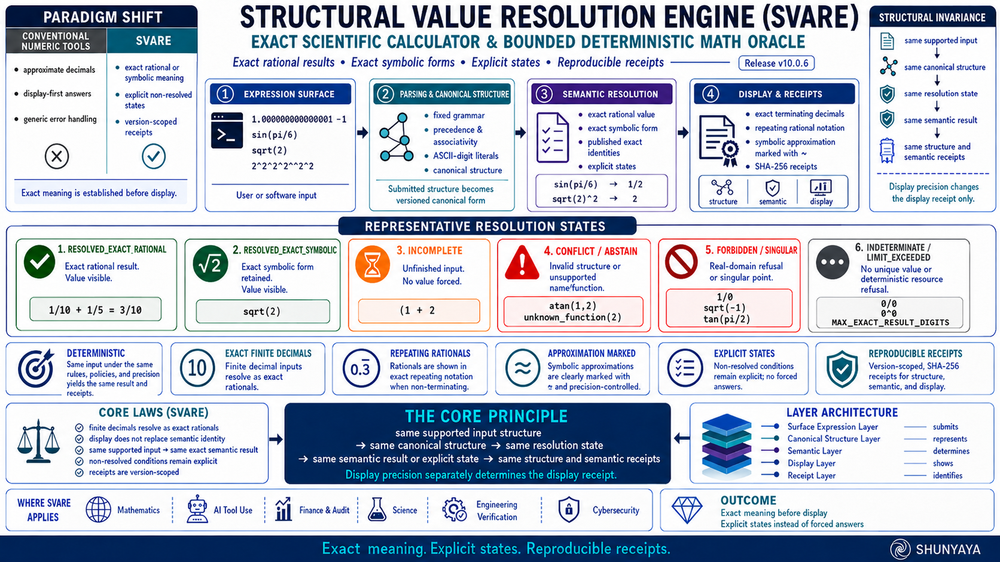

# ⭐ SVARE  

**Structural Value Resolution Engine — Correctness Without Computation**

---


---

**Reveals structurally admissible values through deterministic structural resolution.**

The ~18 KB reference engine demonstrates that:

- value correctness can be validated structurally
- admissibility can be determined independently of floating-point approximation
- incomplete or conflicting structure can safely refuse visibility
- identical structure produces deterministic outcomes

---

🌐 **SVARE — Structural Value Resolution Engine**

Where Structure Resolves and Value Becomes Visible

SVARE removes floating-point approximation and execution-order dependency as requirements for deterministic value correctness.

Value correctness does not depend on floating-point execution behavior, evaluation order, or approximation-driven pipelines.

Value is revealed only when structure uniquely resolves.

---

**Deterministic • Structure-Based • Exact Structural Resolution • Explicit Admissibility States • Order-Independent Structural Validation**

---

## ⚡ Instant Proof

Type this into a classical calculator:

1.0000000000000001 - 1.0000000000000000

Some systems collapse this to:
0

Others display:
1e-16

Both are surface representations.

SVARE reveals:
0.0000000000000001

The full structural residual — not an approximation.

Not because it is "more precise."
But because it does not make a value visible until the structure is complete and consistent.

---

## ⚡ **The Claim**

A valid value can be deterministically resolved from complete AND consistent structure without depending on floating-point approximation, evaluation order, or execution-specific behavior.

---

## 🧱 **Core Principle**

`value_visible iff structure_uniquely_resolves`  
`structure_uniquely_resolves = complete AND consistent`

SVARE establishes that value correctness is determined by structural sufficiency — not by arithmetic execution, evaluation order, or floating-point machinery.

---

## 🚀 **The Core Insight (30-Second Revolution)**

What if value correctness never required arithmetic execution, floating-point approximation, or step-by-step calculation?

---

**Traditional systems assume:**

value requires calculation  
precision requires numeric computation  
answers require evaluation  
correctness requires arithmetic execution  

---

**SVARE demonstrates:**

When structure uniquely resolves, value becomes visible — deterministically and reproducibly.

`same structure -> same value`  
`incomplete structure -> no forced value`  
`conflicting structure -> no arbitrary value`

---

This is not a faster calculator.

SVARE isolates a different layer:

structural admissibility and deterministic value visibility.

The reference engine demonstrates that deterministic correctness can be governed by structural completeness and consistency rather than floating-point execution behavior alone.

---

## 🧱 **The Unifying Principle**

`correctness = resolve(structure)`

If correctness remains after removing a dependency, that dependency was never fundamental.

---

## 🧩 **Structural Collapse Guarantee**

This framework does not modify classical outcomes.  
It preserves them.

`phi((m, a, s)) = m`

Where:

- `m = classical value`  
- `a = alignment`  
- `s = structural state`  

`structure_uniquely_resolves = complete AND consistent`

No new value is created.  
No approximation is introduced.  
The system collapses to the same classical truth.

---

## 🌍 **Structural Shift**

From approximation-driven evaluation toward explicit structural admissibility and deterministic value visibility.

Traditional systems inherit:  
Approximation • Rounding • Execution dependency  

SVARE systems inherit:  
Determinism • Precision • Structural clarity  

This is not an optimization.  
This is the removal of a non-fundamental dependency.

SVARE distinguishes between:

- structural correctness
- representational visibility
- execution substrate

The reference engine demonstrates that correctness can be validated structurally before representation-specific execution details become relevant.

Computation may still participate in realization and visibility.
SVARE isolates the structural conditions that govern admissibility.

---

## ⚠️ **Clarification — Correctness Without Computation**

SVARE does not claim that no computation ever occurs.

**What SVARE demonstrates:**

- Value correctness does not require computation as a prerequisite or source of truth  
- The engine may perform internal resolution steps, but these act only as a resolution substrate  
- Correctness is determined solely by whether the structure is complete AND consistent  

Computation may reveal value.  
It does not create or determine correctness.

---

**This is the key distinction:**

Traditional systems often treat correctness as emerging from execution and evaluation.

SVARE isolates a different perspective:

`value_visibility = resolve(structure)`

where structural completeness and consistency govern admissibility before representation-specific execution behavior becomes relevant.

The reference implementation includes internal steps for practicality, but those steps do not define truth — structure does.

---

## ⚠️ **Boundary Clarification (Important)**

SVARE is not a claim that all computation disappears.

The reference implementation still performs:

- parsing
- normalization
- exact digit manipulation
- deterministic rule application
- structural resolution steps

These are computational processes in an implementation sense.

The distinction made by SVARE is narrower and more precise:

- floating-point approximation is not required
- evaluation-order dependency is not required
- correctness is governed by structural admissibility conditions
- incomplete or conflicting structure safely prevents visibility

SVARE therefore operates primarily as:

- a deterministic structural validation model
- an explicit admissibility-state system
- a precision-preserving structural resolution engine

rather than a claim that all forms of computation are eliminated.

---

## 🧠 **Practical Interpretation**

Use existing systems to display numbers.

Use SVARE to determine whether the value is structurally correct.

---

## 🧭 **Visual Overview**



---

## 🧱 **Layer Separation (Critical)**

**Structure Layer:**  
determines value truth  

**Representation Layer:**  
numbers, expressions, formatting (optional)  

**Execution Layer:**  
calculation, arithmetic, evaluation (optional)  

SVARE operates only at the Structure Layer.

---

## 🔍 **Structural Correctness vs Execution**

SVARE focuses on:

- structural admissibility
- deterministic visibility
- explicit incompleteness handling
- conflict-safe resolution

The implementation may still perform internal evaluation steps.
However, those steps do not override structural validity conditions.

---

## 🔥 **Break This SVARE (Immediate Challenge)**

If computation is required for correctness, this invariant must fail:

`same structure -> same value`

certificate identity depends on structural encoding  
(canonical same-certificate identity is a future extension)

---

**Or demonstrate:**

`incomplete structure -> forced value`  
`conflicting structure -> arbitrary value`  
`reordered structure -> different outcome`

---

If none occur, deterministic correctness depends fundamentally on structural validity conditions — not merely on floating-point execution behavior.

---

## ⚡ **The Critical Line**

Across every structural domain:

`remove dependency -> structure remains -> correctness preserved`

Nothing was improved.  
Nothing was optimized.  
Nothing was replaced.  

Only the dependency was removed.  

And correctness remained.

---

## 🌍 **A World Built on Computation**

For decades, systems have been built on dependencies:

arithmetic  
evaluation order  
floating-point systems  
execution pipelines  

Each treated as essential.

---

## 🔄 **The Shift**

Across domains:

correctness does not depend on the mechanism we assumed it did

It is preserved by:

**structure**

---

## ⚡ **The One-Line Insight**

Deterministic value visibility can be governed by structural completeness and consistency rather than floating-point approximation or execution-order behavior.

---

## ⚡ **The Core Truth**

`value_visibility = resolve(structure)`

where:

`structure_uniquely_resolves = complete AND consistent`

---

## ⚡ **Structural Absence Principle**

If structure is not complete and consistent:  
value does not exist  

`incomplete -> no value`  
`conflict -> no value`

Absence is structural truth.

---

## ⚡ **Try it in 30 seconds**

```
python demo/svare_v8_1.py
```

---

## 🔍 **What You Will Observe**

- deterministic value resolution  
- no arithmetic dependency  
- no floating-point rounding  
- precision preserved  
- structure-driven outcomes  

---

## 🔐 **Reproducibility Guarantee (30-Second Proof)**

Run the reference engine multiple times from the repository root with the same input:

```
python demo/svare_v8_1.py "5 + 2"
```

```
python demo/svare_v8_1.py "5 + 2"
```

---

**Expected result:**

- Identical visible value  
- Equivalent structural resolution  
- Certificate identity depends on structural encoding  
  (canonical identity is a future extension)  
- Identical resolution state  

---

This is the empirical validation of structural determinism:

`same input structure -> same visible value`  
`same input structure -> same resolution state`  
`same input structure -> same certificate`

---

Canonical same-certificate identity across equivalent surfaces is a future extension.

No floating-point variance.  
No ordering dependency.  
No external libraries.

---

## 🧩 **From Minimal Engine to Full Systems**

This reference engine isolates the structural invariant.

It is the smallest visible proof.

---

**Future SVARE systems may expand into:**

- chained resolution  
- hierarchical value structures  
- object structures  
- structural graphs  
- domain-specific value systems  

---

The invariant remains identical:

`same structure -> same value`

---

**The difference is scope:**

minimal engines isolate the truth  
full systems demonstrate it at scale  

---

The principle does not change with size.  
Only its visibility increases.

---

## 🧩 **Reference Demonstration**

**Scenario 1 — Valid Structure**  
→ value appears  

**Scenario 2 — Incomplete Structure**  
→ INCOMPLETE

**Scenario 3 — Conflict**  
→ CONFLICT  

---

🔹 **What this output represents**

- value appears only when structure resolves  
- structure governs visibility  
- values are deterministic  

---

## 🧭 **Framework & References**

### **Docs**
- [Quickstart](docs/Quickstart.md)  
- [FAQ](docs/FAQ.md)  
- [Proof Sketch](docs/Proof-Sketch.md)  
- [SVARE Concept Diagram](docs/SVARE_Diagram.png)  

---

**Note:**  
Certificate identity shown in the SVARE concept diagram is illustrative.  
In Phase I, certificate identity depends on structural encoding.  
Canonical identity is a future extension.

---

### **Framework**

- [SVARE Framework Document](docs/SVARE_v.1.3.pdf)  
- [SVARE Architecture Notes](docs/SVARE-Architecture-Notes.md)  
- [Dependency Elimination Framework](docs/Dependency-Elimination-Framework.png)  
- [Shunyaya Structural Stack](docs/Shunyaya-Structural-Stack.png)  

---

SVARE is part of the **Dependency Elimination Framework**, where:

`correctness = structure`

Removing assumed dependencies does not break correctness —  
it reveals that correctness was always determined by structure.

---

## 🧪 **Demo**

- [svare_v8_1.py](demo/svare_v8_1.py)  
- [SVARE_HTML_v8_1.html](demo/SVARE_HTML_v8_1.html)
- [SVARE_Deterministic_Structural_Cinema_v8_8.py](concept_demo/SVARE_Deterministic_Structural_Cinema_v8_8.py)

---

## 🔐 **Verification**

- [VERIFY.txt](VERIFY/VERIFY.txt)  
- [FREEZE_DEMO_SHA256.txt](VERIFY/FREEZE_DEMO_SHA256.txt)  

---

## 📁 **Repository Structure**

- `demo/` — reference kernel  
- `docs/` — conceptual and framework documentation  
- `VERIFY/` — reproducibility and integrity checks

---

## ⚡ **Structural Model**

`resolve(structure) ->`

- RESOLVED  
- INCOMPLETE
- CONFLICT  

---

## 🛡 **Structural Safety & Guarantees**

SVARE never forces visibility.

`incomplete -> no forced value`  
`conflict -> no arbitrary value`  
`complete -> deterministic value`

`identical structure -> identical value`  
`different visible value -> different structure`

---

Reproducible across runs.  

**Classical collapse preserved:**

`phi((m, a, s)) = m`

---

Absence is truth.  
Silence is valid output.  

**This is structural safety.**

---

## 🔥 **Deterministic Invariant**

`same structure -> same value`

certificate identity depends on structural encoding  
(canonical same-certificate identity is a future extension)

No arithmetic, ordering, or execution can alter this.

---

## 📊 **Comparison**

| Model                | Computation Required            | Structure-Based | Deterministic |
|----------------------|--------------------------------|-----------------|---------------|
| Classical Arithmetic | Yes                            | No              | Conditional   |
| Floating Point       | Yes                            | Partial         | Conditional   |
| SVARE                | Not required for correctness   | Yes             | Yes           |

---

## 🧠 **Critical Insight**

The reference engine still performs internal evaluation and exact symbolic-style resolution steps.

Its distinguishing property is not the elimination of all computation.

Its distinguishing property is:

- deterministic structural admissibility
- explicit incompleteness handling
- conflict-safe visibility
- precision-preserving resolution
- execution-independent structural validation

---

## 🌌 **Why This Is Bigger Than It Looks**

Minimal proof that deterministic value visibility can be structurally validated independently of floating-point approximation and execution-order dependency:

- deterministic correctness can be structurally validated  
- precision can be preserved without floating-point approximation  
- admissibility can be determined independently of execution-order behavior

---

## 🔥 **SVARE Challenge — Where Structure Outperforms Computation**

Explore real test cases where classical systems lose precision, collapse structure, or depend on evaluation — and how SVARE preserves correctness deterministically.

→ [SVARE Challenge](docs/SVARE-Challenge.md)

---

These are not benchmarks.

They are structural falsification tests for the assumption that computation is required for correctness.

---

## 🧾 **Structural Lineage**

SLANG → correctness without execution  
STIME → correctness without time  
STINT → correctness without connectivity  
STILE → correctness without communication  
SVARE → correctness without computation  

---

## ⚖️ **What SVARE Is / Claims / Does Not Claim**

### **SVARE IS:**

- a structural value-resolution engine  
- a deterministic proof that value correctness emerges from structure  
- a system where the same structure always produces the same value; certificate identity depends on structural encoding  
- a model where incomplete or conflicting structure produces no value (safe absence)  
- a minimal reference model for correctness without computation dependency  
- a Phase I demonstration of structure-first value resolution  
- part of the Shunyaya Dependency Elimination Framework  

---

### **SVARE CLAIMS:**

- Value correctness can be determined from complete AND consistent structure alone  
- Computation is not required as a prerequisite for correctness  
- Structure — not execution — defines truth  

---

### **SVARE IS NOT:**

- a production calculator or drop-in replacement for decimal / mpmath  
- a replacement for all arithmetic systems  
- a symbolic algebra or computer algebra system  
- a system supporting chained expressions or multi-step evaluation in Phase I  
- a certified financial, scientific, or safety-critical solution (research artifact only)  
- an optimization of existing arithmetic — it is a different correctness model  

---

### **SVARE DOES NOT CLAIM:**

- that the reference engine performs zero internal work  
- that implementation steps define correctness  

---

## 📜 **License**

See: [LICENSE](LICENSE)

**Reference Implementation (This Repository):**

This SVARE reference engine (Python + HTML demo) is released as an **Open Standard** —  
free to use, study, implement, extend, and deploy.

It represents a minimal deterministic demonstration of structural value resolution.

**Architecture and Documentation:**

Licensed under **CC BY-NC 4.0**

---

## 🔭 **Roadmap (Exploratory)**

| Milestone                  | Description                                                                 | Status    |
|---------------------------|-----------------------------------------------------------------------------|-----------|
| Chain resolution          | Multi-step structural evaluation                                            | Planned   |
| Structural graphs         | Hierarchical resolution and dependency graphs                               | Planned   |
| Object structures         | Shape, hierarchy, balance                                                   | Planned   |
| Canonical value identity  | Same resolved value → same canonical certificate (surface-independent)      | Planned   |
| Domain extensions         | Finance, scientific systems, verification                                   | Open      |
| Formal verification       | Lightweight proof of resolution kernel correctness                          | Research  |
| Language bindings         | Python package, WebAssembly, Rust port                                      | Future    |
| Structural decidability bounds | Explicit admissibility boundaries for hierarchical and graph-based structures | Research |

---

## 🔗 **Related Structural References**

SVARE is part of a broader structural ecosystem where each system removes a specific assumed dependency — yet correctness remains preserved.

`correctness = resolve(structure)`

---

## 🧱 **Cross-System Dependency Elimination Map**

| Domain        | System | Removed Dependency                  | What Preserves Correctness |
|---------------|--------|------------------------------------|----------------------------|
| Computation   | [SLANG-Computation](https://github.com/OMPSHUNYAYA/SLANG-Computation) | Execution flow             | Structure |
| Computation   | [STOCRS](https://github.com/OMPSHUNYAYA/STOCRS)                     | Execution pipelines        | Structure |
| Arithmetic    | SVARE                                                               | Computation                | Structure |
| Time          | [STIME](https://github.com/OMPSHUNYAYA/Structural-Time)              | Clocks                     | Structure |
| Time          | [SSUM-Time](https://github.com/OMPSHUNYAYA/SSUM-Time)                | Time reconstruction        | Structure |
| Ordering      | [ORL](https://github.com/OMPSHUNYAYA/Orderless-Ledger)              | Ordering / sequence        | Structure |
| Connectivity  | [STINT-Money](https://github.com/OMPSHUNYAYA/STINT-Money)           | Continuous connectivity    | Structure |
| Communication | [STILE](https://github.com/OMPSHUNYAYA/STILE)                       | Messaging / network        | Structure |
| Traversal     | [STRAL-Path](https://github.com/OMPSHUNYAYA/STRAL-Path)             | Traversal / search         | Structure |
| Finance       | [SLANG-Money](https://github.com/OMPSHUNYAYA/SLANG-Money)           | Transactions               | Structure |
| Audit         | [SLANG-Audit](https://github.com/OMPSHUNYAYA/SLANG-Audit)           | Verification workflows     | Structure |

---

### 🌌 **The Unifying Insight**

remove dependency → structure remains → correctness preserved

Nothing is replaced.  
Nothing is approximated.  
Only the dependency is eliminated.

And correctness does not break.

---

### 🧭 **Structural Lineage**

SLANG → execution  
STIME → time  
STINT → connectivity  
STILE → communication  
STRAL → traversal  
SVARE → computation  

---

### ⚡ **The Pattern**

Each system answers a deeper question:

Does correctness depend on what we assumed it did?

SVARE answers:

**Does value require computation?**  

**No. It requires structure.**

---

## 🧭 **Final Statement**

SVARE distinguishes between:

- structural admissibility
- representational realization
- execution substrate

The reference engine demonstrates that deterministic value visibility can be governed by structural completeness and consistency before execution-specific approximation behavior becomes relevant.

When structure uniquely resolves, value becomes visible deterministically and reproducibly.

**This is SVARE.**
